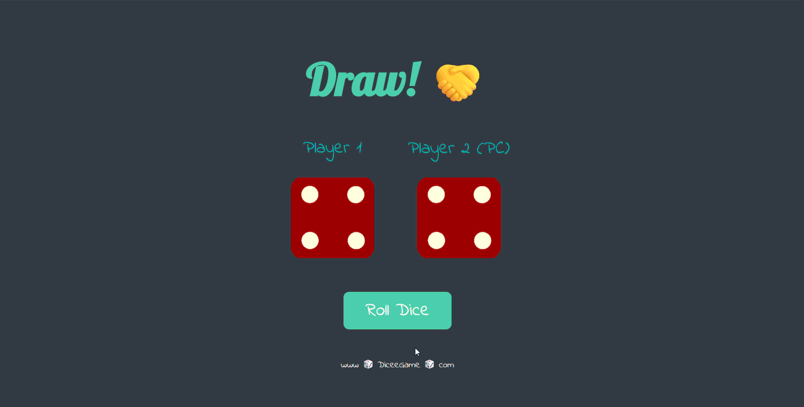

# 🎲 Dicee Game

A simple and fun dice game built with React where you can challenge the computer! Roll the dice and see who gets the higher number.

## 🎮 Live Demo

[Play the Game Here](https://hkn-dice-game1.netlify.app/)


## 📸 Demo



## ✨ Features

- 🎯 Player vs Computer gameplay
- 🎨 Clean and attractive UI with custom fonts
- 🎭 Smooth dice rolling animation
- ✏️ Customizable player name
- 🏆 Automatic winner detection
- 📱 Responsive design

## 🛠️ Technologies Used

- **React** - UI library
- **CSS3** - Styling and animations
- **Google Fonts** - Custom typography (Lobster & Indie Flower)

## 🚀 Getting Started

### Prerequisites

- Node.js (v14 or higher)
- npm or yarn

### Installation

1. Clone the repository
```bash
git clone https://github.com/hknkhrmn/Patika-Frontend-Bootcamp.git
cd Patika-Frontend-Bootcamp/Week-9/dice-game
```

2. Install dependencies
```bash
npm install
```

3. Start the development server
```bash
npm run dev
```

4. Open your browser and visit `http://localhost:5173`

## 🎯 How to Play

1. Enter your name in the input field (or keep the default "Player 1")
2. Click the "Roll Dice" button
3. Watch the dice animation
4. See who wins - you or the computer!
5. Roll again to play another round

## 📁 Project Structure

```
dice-game/
├── src/
│   ├── assets/
│   │   ├── dice1.png
│   │   ├── dice2.png
│   │   ├── dice3.png
│   │   ├── dice4.png
│   │   ├── dice5.png
│   │   └── dice6.png
│   ├── App.jsx
│   ├── App.css
│   └── main.jsx
├── public/
├── package.json
└── README.md
```

## 🎨 Color Palette

- Background: `#393e46`
- Primary: `#4ecca3`
- Secondary: `#00adb5`
- Text: `#eeeeee`

## 🤝 Contributing

Contributions are welcome! Feel free to open an issue or submit a pull request.

## 📝 License

This project is open source and available under the [MIT License](LICENSE).

## 👨‍💻 Author

**Hakan Karaman**
- GitHub: [@hknkhrmn](https://github.com/hknkhrmn)
- Project: [Patika Frontend Bootcamp - Week 9](https://github.com/hknkhrmn/Patika-Frontend-Bootcamp/tree/ed148c60d56ca95b22cea569f20a6d48d5b5d82d/Week-9)

## 🙏 Acknowledgments

- Dice images from [Patika Dev]
- Inspired by Patika dice games

---

Made with React